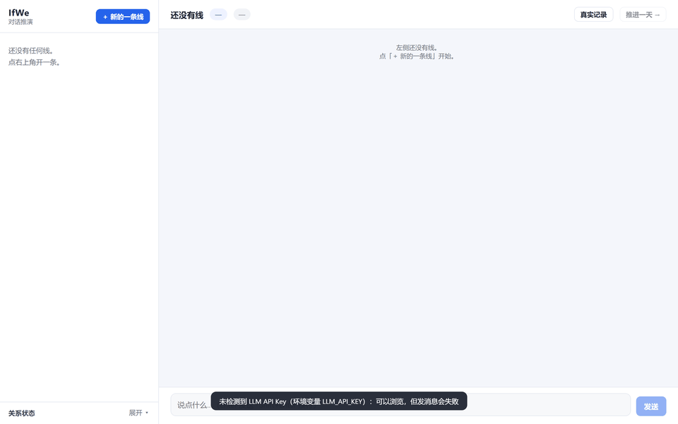

# IfWe · If We Were Us

<div align="center">

**A warm reply is something every chatbot has.**
**Sounding like *them* is something only memory can give.**

IfWe rebuilds a digital persona from your real chat history — one with
your shared habits of speech, your common memories, even the stickers
TA actually used. Go back to any moment you wish had gone differently,
rewrite one sentence — and let the person in your memory answer
"what if" for you.

[中文](README.md) · Quick Start · [Import Guide](docs/IMPORT_EN.md) · [Architecture](docs/ARCHITECTURE_EN.md) · [Privacy](PRIVACY_EN.md) · [Disclaimer](DISCLAIMER_EN.md)

</div>

---

<!-- TODO(before release): put a 30-second demo GIF here (record it with the sample data ONLY;
     using real chat logs is strictly forbidden). Storyboard: docs/demo/README.md -->


## This is not role-play

Most AI-companion products are, at heart, "an actor wearing a persona":
the warm tone is generic, the attentive listening is generic, even the
"I miss you" comes from a template. Change the name, and the same
persona can perform for anyone.

IfWe takes a different road. The digital persona here has no preset
character card — everything about TA is derived from your records:

- **The way TA speaks comes from you two.** The system analyzes word
  choice, sentence length, punctuation and catchphrases (L layer),
  recent stress and preoccupations (M layer), typical conflict and
  repair patterns (S layer), and how TA describes TA-self (U layer).
  A four-layer profile where every line has a source — not adjectives
  in a prompt.
- **TA's memories come from you two.** A two-tier memory system turns
  shared experiences into retrievable facts: things you did together,
  plans you discussed, stretches when no words were exchanged. The
  conversation retrieves memories "as of" the current day — TA only
  remembers what TA should know by then.
- **Even the stickers are real.** Stickers TA actually used are replayed
  weighted by frequency — not a random pull from a sticker pack
  pretending to be a mood.
- **TA changes.** The five-dimension relationship state (closeness /
  conflict / trust / emotional safety / communication quality) evolves
  with every interaction. A careless reply and a sincere apology leave
  different marks on the timeline — TA won't forgive endlessly, nor go
  cold without reason.

So we don't call this "an AI playing a gentle character". What we built
is this: **let the person who lives in your memory be treated, inside
the model, seriously and completely — once more.**

## What is this

IfWe is a **local-first** relationship timeline tool:

1. **Import** your chat history with someone important (a file you lawfully exported yourself: WeFlow / WeChatMsg / Telegram official exports are supported);
2. The system sanitizes, extracts events, builds memories and estimates relationship
   state — all locally;
3. Pick a "fork point" on the timeline — one sentence you did or didn't say that day —
   and **rewrite it**;
4. Keep talking with a digital persona grounded in real memories and personality,
   and see where the relationship might have gone.

> It is not a chat-log manager, and not an "AI girlfriend". It cares about one
> concrete question: **if you had phrased it differently, what then?**

## Highlights

| Feature | Description |
|---|---|
| 🧬 Four-layer persona | Language style / stress & meaning / emotion & conflict patterns / self-image — all derived from the records, hand-editable. A persona with provenance, not a character card |
| 🧠 Two-tier memory | Long-term memory (bi-temporal facts + optional local vector search) + short-term buffer with auto summarization; after a fork, the real future is "frozen" out of context |
| 🕰 Timeline forks | Monthly message volume, 5-dimension relationship state, turning points (gaps / events / peaks) at a glance |
| 🔀 IF-branch rewrite | Jump to any day + rewrite one sentence; the persona treats the rewrite as fact and carries on |
| 🖼 Real stickers | The partner's actual stickers are replayed weighted by usage frequency (point `media.emojis_dir` at your export folder) |
| 🔒 Local-first | Chats, analysis and the database all live in local SQLite; only reply generation sends sanitized context to *your own* LLM API |
| 🧹 Sanitize on import | Phone numbers / addresses / IDs / bank cards are replaced with placeholders at import time; sanitized text is the only input for later stages |
| 🛡 Privacy gate | Built-in `check_privacy.py`: scans the repo for privacy residue, exits non-zero on any hit (CI-ready) |

## Quick start in 3 steps

```bash
# 0) Install (Python >= 3.10)
pip install -r requirements.txt

# 1) Try the full UI with fictional sample data — no real data involved
python run.py demo

# 2) When your own data is ready: create config → import → analyze
python run.py init
python run.py init --source your_export.jsonl --sender-a "your_handle" --sender-b "their_handle"
python run.py analyze            # offline path: python run.py analyze --skip-llm

# 3) Launch the local UI (binds to 127.0.0.1 only)
python run.py server             # → http://127.0.0.1:8015
```

See [docs/QUICKSTART_EN.md](docs/QUICKSTART_EN.md) and [docs/IMPORT_EN.md](docs/IMPORT_EN.md)
for details, data formats and FAQ.

## An honest boundary

The digital persona improvises on your records. However convincing TA's
replies look, **TA is not the real person** — TA is an echo of your memory,
a model's improvisation on a shared past. Do not use replayed conversations
as a basis for communicating with them, making life decisions, or judging them.

This project grew out of a real loss. If you are reading it from a similar
place right now: a tool can only accompany you as far as tools go — the rest
of the road belongs to real people, friends, family, or professionals
(helplines in [DISCLAIMER_EN.md](DISCLAIMER_EN.md)). We wrote this boundary
into the product itself: the UI labels estimates as "simulation, not fact",
and our ethics guide is explicit about not hiding from real life inside replays.

**Practice saying the words — then go back to real life.**

## Privacy by design (the core differentiator)

- **Nothing leaves your machine** except the explicit LLM calls you configure; `data/` is
  always gitignored, and personal content never mixes with the codebase.
- **Sanitization boundary**: only `content_clean` (denoised + sanitized) and derived
  conclusions are ever sent to the LLM — never raw logs.
- **Simulation isolation**: every "what-if" conversation lives in a `sim_*` namespace;
  the main database is read-only to the simulator.
- **Self-audit**: `python scripts/check_privacy.py` scans the whole repo against a
  red-line word list and exits non-zero on any hit.
- See [PRIVACY_EN.md](PRIVACY_EN.md).

## Architecture

```
chat JSONL ──► Phase1 import/sanitize ──► analyze(events/memories/state/turning points/persona)
                                                │
                                                ▼
                  local Web UI ◄──► Phase15 API service ◄──► DialEngine replay kernel
                  (127.0.0.1)          (FastAPI)                  │
                                                                  ▼
                                               PersonaAgent(B) + memory retrieval + RelEngine
```

Why a homegrown memory layer instead of Graphiti, why SQLite instead of a graph
database — see [docs/ARCHITECTURE_EN.md](docs/ARCHITECTURE_EN.md).

## Configuration

Copy `config.example.yaml` to `config.yaml` and edit: display names, chat source path,
LLM provider/model, sticker folder, simulation parameters. **API keys live in
environment variables only** (`LLM_API_KEY` by default); any OpenAI-compatible
endpoint works (DeepSeek / GLM / local inference).

## Read before use

- [DISCLAIMER_EN.md](DISCLAIMER_EN.md) — not therapy, not prediction, and generated
  content never represents the real person's will; if you are in crisis, see the
  helplines listed there.
- [PRIVACY_EN.md](PRIVACY_EN.md) — data flow, sanitization boundary, LLM scope.
- Using this tool to track, harass or monitor real people is **strictly forbidden**;
  you are responsible for the legality of imported data.

## Roadmap

- [x] v0.2 more import formats (WeChatMsg, Telegram, import doctor, web wizard)
- [ ] v0.3 research-metric scripts (sensitivity / scoring / evaluation — out of v0.1 scope)
- [ ] Web form editor for persona files
- [ ] Relationship-state visualization panel (productized research module)
- [ ] Full analysis pipeline (v0.1 ships a simplified one)

## License

[MIT](LICENSE) + additional terms (no tracking / harassment / surveillance of real people).

---

<div align="center">

"We can't go back. But we can practice the words."

</div>
